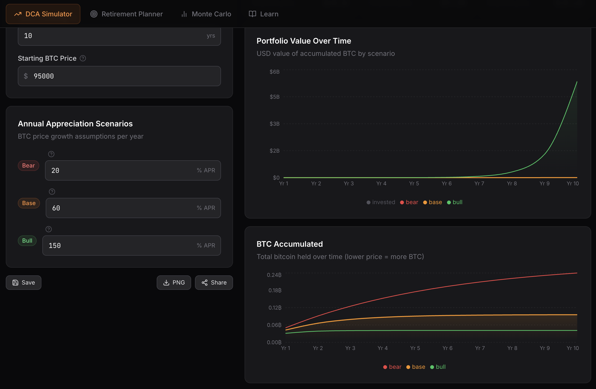

# SatStacker — Bitcoin Wealth Planner

An open-source Bitcoin wealth planning tool for long-term stackers. Model DCA strategies, stress-test retirement scenarios, and run Monte Carlo simulations — all in your browser with no account required.

## Features

- **DCA Simulator** — Model weekly/monthly Bitcoin purchases across bear, base, and bull appreciation scenarios. See portfolio value and BTC accumulation over time with interactive charts.
- **Retirement Planner** — Input desired spending, retirement age, and inflation assumptions. Get the required portfolio size, BTC needed, and a suggested weekly DCA to hit your goal.
- **Monte Carlo Simulation** — Run 100–1,000 randomized log-normal return simulations. Visualize the 10th, 25th, 50th, 75th, and 90th percentile outcome bands.
- **BTC / sats / USD toggle** — Display all values in your preferred denomination.
- **Scenario saving** — Save named scenarios to localStorage and reload them anytime.
- **URL sharing** — Share DCA scenarios via URL parameters.
- **PNG export** — Export results as an image.
- **Educational content** — Expandable explainers on DCA, volatility, scenario modeling, and risk.

## Screenshots




## Setup

**Requirements:** Node.js 18+

```bash
# Clone the repo
git clone https://github.com/your-username/satstacker.git
cd satstacker

# Install dependencies
npm install

# Start dev server
npm run dev
```

Open `http://localhost:5173` in your browser.

## Build

```bash
npm run build
```

The production build outputs to `dist/`.

## Deploy to Vercel

### Option 1: Vercel CLI

```bash
npm install -g vercel
vercel
```

### Option 2: GitHub integration

1. Push this repo to GitHub
2. Go to [vercel.com/new](https://vercel.com/new)
3. Import your repository
4. Vercel auto-detects Vite — click **Deploy**

No environment variables required. The app is entirely client-side.

## Tech Stack

| Layer | Technology |
|---|---|
| Framework | React 18 + TypeScript |
| Build | Vite 5 |
| Styling | Tailwind CSS v3 |
| Charts | Recharts 2 |
| Icons | Lucide React |
| Export | html-to-image |
| Storage | localStorage (browser-native) |

## Project Structure

```
src/
├── components/
│   ├── ui/              # Card, Input, Button, Badge, Tooltip, Select
│   ├── DCASimulator.tsx
│   ├── RetirementPlanner.tsx
│   ├── MonteCarloView.tsx
│   ├── EducationalSection.tsx
│   ├── Header.tsx
│   ├── Footer.tsx
│   ├── UnitToggle.tsx
│   └── ScenarioManager.tsx
├── hooks/
│   ├── useLocalStorage.ts
│   └── useUnit.ts
├── utils/
│   ├── calculations.ts  # DCA + retirement math
│   ├── formatting.ts    # Number/unit formatting
│   ├── monteCarlo.ts    # Log-normal simulation engine
│   └── urlParams.ts     # URL encode/decode
├── types/
│   └── index.ts
├── App.tsx
├── main.tsx
└── index.css
```

## Calculation Notes

### DCA Model
Contributions are made monthly (weekly × 52/12 + monthly). Bitcoin price compounds at the assumed APR. CAGR is computed as `(finalValue / totalInvested)^(1/years) - 1`.

### Retirement Model
Uses a **3.5% safe withdrawal rate** — more conservative than the traditional 4% rule to account for Bitcoin's volatility. Required portfolio = inflation-adjusted spending ÷ 0.035. Suggested DCA is found via binary search against the base-case DCA projection.

### Monte Carlo Model
Log-normal annual returns: `return = exp(μ + σ × N(0,1)) - 1` where `μ = ln(1 + mean) - σ²/2`. This corrects for Jensen's inequality, ensuring the expected arithmetic return matches your input.

## Disclaimer

Educational tool only. Not financial advice. All projections are hypothetical scenarios — not predictions. Bitcoin is highly volatile and speculative. Past performance does not guarantee future results. Consult a qualified financial advisor before making investment decisions.

## License

MIT License. Built for educational purposes.

---

*Made with ₿ for the stacking community.*
